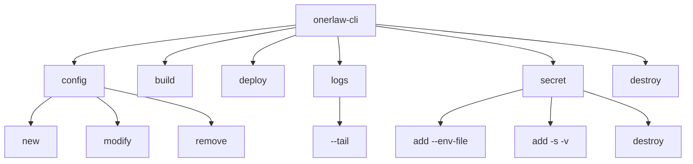
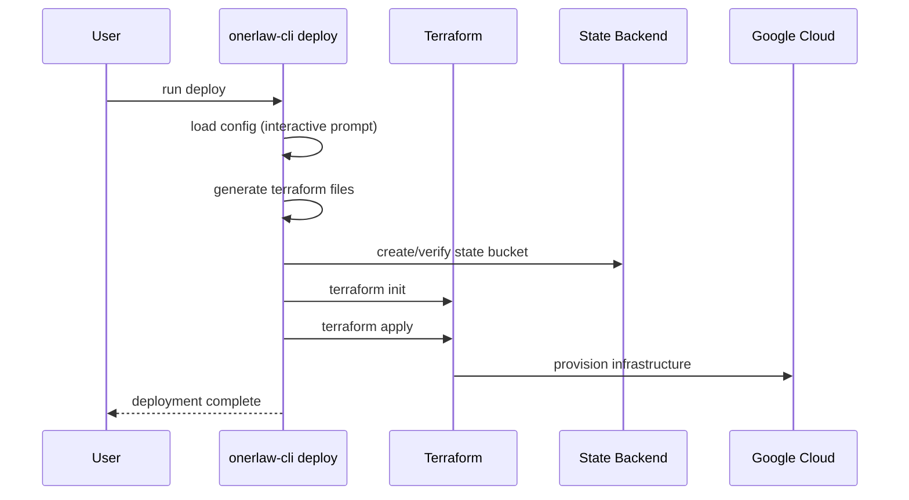
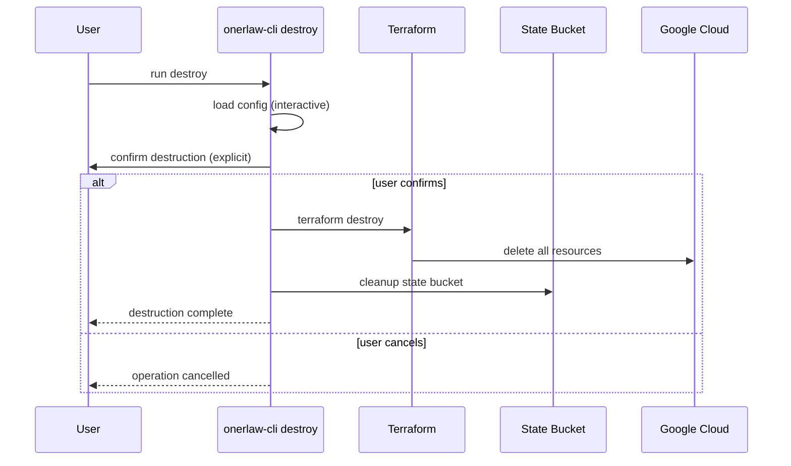

# Onerlaw CLI

A powerful command-line interface for deploying and managing Google Cloud infrastructure using Terraform. The Onerlaw CLI simplifies the process of setting up, configuring, and managing cloud infrastructure with an intuitive command structure.

## Features

- 🚀 **Infrastructure as Code**: Deploy complete Google Cloud infrastructure using Terraform
- 🔧 **Configuration Management**: Easy configuration creation, modification, and removal
- 🔐 **Secret Management**: Secure handling of sensitive information via Google Secret Manager
- 🏗️ **Container Management**: Build and push Docker images to Artifact Registry
- 📊 **Log Management**: Real-time log streaming from Cloud Run services
- 🗑️ **Clean Destruction**: Safely destroy infrastructure when no longer needed
- 🌐 **Multi-Environment Support**: Support for dev, staging, and production environments
- 📦 **Modular Architecture**: Well-organized Terraform modules for maintainable infrastructure

## Documentation

- **[Terraform Architecture](docs/terraform-architecture.md)** - Complete infrastructure architecture and module breakdown
- **[Configuration Schema](docs/configuration.md)** - Detailed configuration options and schema documentation

## Installation

```bash
npm install -g @onerlaw/cli
```

## Available Commands

### Command Tree



### Configuration Management

The configuration system manages your infrastructure settings and deployment preferences.

#### `config new`
Creates a new configuration for your infrastructure deployment.

```bash
onerlaw-cli config new
```

**Interactive prompts for**:
- **Google Cloud Project ID**: Target GCP project
- **Environment type**: `dev`, `staging`, or `prod`
- **Environment name**: Unique identifier for this environment
- **Database configuration** (optional): PostgreSQL database settings
- **Pub/Sub configuration** (optional): Message queue settings
- **Apps configuration** (optional): Cloud Run application definitions
- **DNS configuration** (optional): Custom domain and subdomain settings

**What it creates**:
- Local configuration file with your infrastructure preferences
- Ready-to-deploy Terraform configuration when you run `deploy`

#### `config modify`
Modifies existing configurations interactively.

```bash
onerlaw-cli config modify
```

**Allows updating**:
- Project settings and environment configuration
- Database parameters (enable/disable, change names)
- Apps configuration (add/remove/modify applications)
- DNS settings (domains and subdomains)
- Pub/Sub configuration (topics and subscriptions)

#### `config remove`
Removes existing configurations.

```bash
onerlaw-cli config remove
```

**Features**:
- Interactive selection of configuration to remove
- Confirmation prompts to prevent accidental deletion
- Cleans up local configuration files only (doesn't affect deployed infrastructure)

### Container Management

#### `build`
Builds and pushes Docker images to Artifact Registry.

```bash
onerlaw-cli build
```

**Process**:
1. **Load configuration**: Select project, environment, and app to build
2. **Select application**: Choose which app to build (if multiple configured)
3. **Configure Docker authentication**: Authenticate with Artifact Registry
4. **Generate image tag**: Create next available numeric tag automatically
5. **Build Docker image**: Build with platform targeting and NPM token support
6. **Push to registry**: Upload to Google Artifact Registry

**Features**:
- **Automatic tagging**: Sequential numeric tags (1, 2, 3, etc.)
- **NPM token support**: Secure NPM package access during builds
- **Multi-platform builds**: Targets `linux/amd64` for Cloud Run compatibility
- **Registry authentication**: Automatic Docker credential configuration

**Image naming convention**:
```
us-central1-docker.pkg.dev/{project}/{environment}-{environment_name}/{app_name}:{tag}
```

**Example**:
```bash
# Build for project "my-project", environment "prod", environment name "api", app "backend"
# Results in: us-central1-docker.pkg.dev/my-project/prod-api/backend:1
onerlaw-cli build
```

### Infrastructure Deployment

#### `deploy`
Deploys the complete infrastructure using Terraform.

```bash
onerlaw-cli deploy
```

**Process**:
1. **Load configuration**: Interactive selection of project and environment
2. **Generate Terraform files**: Create infrastructure definitions from config
3. **Setup state backend**: Create GCS bucket for Terraform state (if needed)
4. **Initialize Terraform**: Download providers and prepare working directory  
5. **Apply infrastructure**: Create all Google Cloud resources

**What gets deployed**:
- **Networking**: VPC, subnets, firewall rules, VPC connector
- **Compute**: Cloud Run services for each configured app
- **Storage**: Artifact Registry for container images
- **Database** (optional): Cloud SQL PostgreSQL instance with private networking
- **Load Balancer** (optional): Global HTTPS load balancer with SSL certificates
- **DNS** (optional): Managed DNS zones with automatic record creation
- **Pub/Sub** (optional): Topics and subscriptions for message queuing
- **Security**: Service accounts, IAM bindings, Secret Manager integration



### Log Management

#### `logs`
Fetches and streams logs from Cloud Run services.

```bash
# Fetch recent logs
onerlaw-cli logs

# Tail logs continuously (Ctrl+C to stop)
onerlaw-cli logs --tail
```

**Process**:
1. **Load configuration**: Select project and environment
2. **Select application**: Choose which app to view logs for
3. **Fetch recent logs**: Display recent log entries with timestamps
4. **Tail logs** (optional): Continuously poll for new log entries

**Features**:
- **Real-time streaming**: Use `--tail` for live log monitoring
- **Formatted output**: Clean, readable log format with timestamps
- **Service filtering**: Automatic filtering for specific Cloud Run service
- **Error handling**: Clear error messages and troubleshooting guidance

**Log format**:
```
[2024-01-15 10:30:25] INFO: Application started on port 8080
[2024-01-15 10:30:26] INFO: Connected to database successfully
```

**Use cases**:
- **Development**: Monitor application behavior during development
- **Debugging**: Investigate issues in deployed services
- **Monitoring**: Keep watch on production service health
- **Troubleshooting**: Diagnose deployment or runtime problems

### Infrastructure Destruction

#### `destroy`
Safely destroys all deployed infrastructure.

```bash
onerlaw-cli destroy
```

**⚠️ Warning**: This permanently deletes all resources. Use with caution in production.

**Process**:
1. **Load configuration**: Interactive selection of project and environment to destroy
2. **Confirmation prompt**: Explicit confirmation required before destruction
3. **Terraform destroy**: Remove all managed cloud resources
4. **State cleanup**: Clean up Terraform state bucket and backend resources

**What gets destroyed**:
- **All Cloud Run services** and their configurations
- **Load balancers** and SSL certificates
- **DNS zones** and records
- **Cloud SQL databases** and instances ⚠️
- **VPC networks** and associated networking
- **Service accounts** and IAM bindings
- **Terraform state bucket** and backend resources



### Secret Management

The secret management system securely stores and manages sensitive configuration using Google Secret Manager.

#### `secret add`
Creates or updates Google Cloud secrets.

```bash
# Single secret
onerlaw-cli secret add -s <secret-name> -v <secret-value>

# Bulk from .env file
onerlaw-cli secret add --env-file ./path/to/.env
```

**Process**:
1. **Load configuration**: Interactive selection of project and environment
2. **Parse secrets**: Single secret or bulk from .env file
3. **Generate secret names**: Automatic prefixing with environment information
4. **Create/update secrets**: Store in Google Secret Manager
5. **Configure access**: Automatic IAM bindings for Cloud Run services

**Options**:
- `-s, --secret-name <name>`: Name of the secret (without environment prefix)
- `-v, --secret-value <value>`: Value of the secret
- `--env-file <path>`: Path to .env file for bulk operations

**Secret naming convention**:
```
{environment}-{environment_name}-{secret_name}
```

**Example .env file**:
```bash
# .env
DATABASE_PASSWORD=mysecretpassword
API_KEY=abc123def456
JWT_SECRET=super-secure-jwt-key
```

**Features**:
- **Automatic prefixing**: Secrets are namespaced by environment
- **Bulk operations**: Process entire .env files at once
- **Overwrite protection**: Safely updates existing secrets
- **IAM integration**: Automatic access grants for Cloud Run services

#### `secret destroy`
Removes secrets associated with an environment.

```bash
onerlaw-cli secret destroy
```

**Process**:
1. **Load configuration**: Select project and environment
2. **List prefixed secrets**: Find all secrets for the environment
3. **Confirmation prompt**: Explicit confirmation before deletion
4. **Bulk deletion**: Remove all matching secrets

**⚠️ Warning**: This removes ALL secrets prefixed with the environment name.

## Complete Workflow Example

This section demonstrates a complete workflow from initial setup to deployment and monitoring.

### Scenario: Microservices Application

We'll deploy a microservices application with:
- **Frontend**: React app serving the web interface
- **API**: Node.js backend API 
- **Worker**: Background job processor
- **Database**: PostgreSQL for data storage
- **Custom domain**: `myapp.com` with subdomains

### Step 1: Initial Configuration

Create a new configuration with all components:

```bash
onerlaw-cli config new
```

**Interactive prompts and responses**:
```
? Google Cloud Project ID: my-production-project-123
? Environment type: prod
? Environment name: microservices-v1
? Configure database? Yes
  ? Database name: myapp_db
  ? Database user: myapp_user
? Configure Pub/Sub? Yes
  ? Topic name: background-jobs
? Configure applications? Yes
  ? Application name: frontend
  ? Port (default 3000): 3000
  ? Configure DNS for this app? Yes
    ? Domain name: myapp.com
    ? Subdomains (comma-separated): www,app
  ? Add another application? Yes
  ? Application name: api
  ? Port (default 3000): 8080
  ? Configure DNS for this app? Yes
    ? Domain name: myapp.com
    ? Subdomains (comma-separated): api
  ? Add another application? Yes
  ? Application name: worker
  ? Port (default 3000): 3000
  ? Configure DNS for this app? No
  ? Add another application? No
```

### Step 2: Deploy Infrastructure

Deploy the complete infrastructure:

```bash
onerlaw-cli deploy
```

**What happens**:
- Creates VPC network with private subnets
- Deploys Cloud SQL PostgreSQL instance
- Creates Pub/Sub topic and subscription
- Sets up Artifact Registry repositories
- Creates Cloud Run services for each app
- Configures global load balancer with SSL
- Creates DNS zone and records
- Establishes IAM permissions and service accounts

### Step 3: Configure Secrets

Add application secrets for all services:

  ```bash
# Create .env file with all secrets
cat > .env << EOF
# Database credentials (automatically handled by Terraform)
# These are for additional app-specific configs

# API Configuration
JWT_SECRET=super-secure-jwt-secret-key-here
API_SECRET_KEY=api-secret-key-here
STRIPE_SECRET_KEY=sk_live_your_stripe_secret

# External Service Keys
SENDGRID_API_KEY=SG.your-sendgrid-key
REDIS_URL=redis://your-redis-instance
GITHUB_CLIENT_SECRET=your-github-oauth-secret

# Worker Configuration  
WORKER_CONCURRENCY=10
NOTIFICATION_WEBHOOK_SECRET=webhook-secret-here
EOF

# Upload all secrets at once
onerlaw-cli secret add --env-file .env
```

### Step 4: Build and Push Applications

Build Docker images for each application:

  ```bash
# Build frontend application
onerlaw-cli build
# ? Select project/environment: my-production-project-123 / prod-microservices-v1
# ? Select application: frontend
# ✓ Built: us-central1-docker.pkg.dev/my-production-project-123/prod-microservices-v1/frontend:1

# Build API application
onerlaw-cli build
# ? Select application: api  
# ✓ Built: us-central1-docker.pkg.dev/my-production-project-123/prod-microservices-v1/api:2

# Build worker application
onerlaw-cli build
# ? Select application: worker
# ✓ Built: us-central1-docker.pkg.dev/my-production-project-123/prod-microservices-v1/worker:3
```

### Step 5: Monitor Applications

Monitor application logs in real-time:

```bash
# View recent API logs
onerlaw-cli logs
# ? Select application: api

# Tail frontend logs continuously
onerlaw-cli logs --tail
# ? Select application: frontend
# [2024-01-15 10:30:25] INFO: React app started on port 3000
# [2024-01-15 10:30:26] INFO: Connected to API successfully
# Press Ctrl+C to stop

# Check worker job processing
onerlaw-cli logs
# ? Select application: worker
```

### Step 6: DNS Configuration

After deployment, configure your domain DNS:

```bash
# Get name servers from deployment output
# Configure your domain registrar to use Google Cloud DNS name servers:
# ns-cloud-a1.googledomains.com
# ns-cloud-a2.googledomains.com
# ns-cloud-a3.googledomains.com
# ns-cloud-a4.googledomains.com
```

**Result**: Your application is now available at:
- `https://myapp.com` → Frontend
- `https://www.myapp.com` → Frontend  
- `https://app.myapp.com` → Frontend
- `https://api.myapp.com` → API

### Step 7: Application Updates

When you need to deploy updates:

```bash
# Update application code, then rebuild
onerlaw-cli build
# ? Select application: api
# ✓ Built: us-central1-docker.pkg.dev/my-production-project-123/prod-microservices-v1/api:4

# Redeploy infrastructure (updates Cloud Run with new image)
onerlaw-cli deploy

# Monitor the deployment
onerlaw-cli logs --tail
```

### Configuration Management

Modify your setup as needed:

```bash
# Add new applications or modify existing
onerlaw-cli config modify

# Remove configuration when done
onerlaw-cli config remove

# Clean up everything (⚠️ DESTRUCTIVE)
onerlaw-cli destroy
```

### Generated Resources Summary

This workflow creates:

**Compute & Networking**:
- 3 Cloud Run services (frontend, api, worker)
- Global HTTPS load balancer with SSL certificate
- VPC network with private subnet and VPC connector

**Data & Storage**:
- Cloud SQL PostgreSQL instance (`prod-microservices-v1`)
- Database `myapp_db` with user `myapp_user`  
- Artifact Registry repositories for container images
- Pub/Sub topic `background-jobs` with subscription

**Security & Access**:
- 3 service accounts (one per application)
- Secret Manager secrets (JWT keys, API keys, etc.)
- IAM bindings for database, secrets, and Pub/Sub access

**DNS & Domains**:
- Cloud DNS zone for `myapp.com`
- A records: `myapp.com`, `www.myapp.com`, `app.myapp.com`, `api.myapp.com`
- Managed SSL certificate for HTTPS

**State Management**:
- GCS bucket for Terraform state
- Backend service account for state access

## Quick Reference

### Environment Support

The CLI supports three environment types with different resource allocations:

- **dev**: Development environment with minimal resources
- **staging**: Staging environment for testing
- **prod**: Production environment with full resources

Each environment can have a unique name (e.g., "my-app-dev", "my-app-staging", "my-app-prod").

### Resource Naming Conventions

All Google Cloud resources follow consistent patterns:

- **Cloud Run Services**: `{environment}-{environment_name}-{app_name}`
- **Container Registries**: `{environment}-{environment_name}`
- **Database Instances**: `{environment}-{environment_name}`
- **VPC Networks**: `{environment}-{environment_name}-vpc`
- **Service Accounts**: `{environment}-{environment_name}-{app_name}-sa`

### Container Image URLs

```
us-central1-docker.pkg.dev/{project}/{environment}-{environment_name}/{app_name}:{tag}
```

Example: `us-central1-docker.pkg.dev/my-project/prod-api-v1/backend:3`

## Prerequisites

Before using the Onerlaw CLI, ensure you have:

1. **Google Cloud SDK** installed and configured
2. **Terraform** installed (version 1.0 or higher)
3. **Node.js** (version 18 or higher)
4. **Google Cloud Project** with billing enabled
5. **Required APIs** enabled in your project

## Getting Started

1. **Install the CLI**:
   ```bash
   npm install -g @onerlaw/cli
   ```

2. **Create a new configuration**:
   ```bash
   onerlaw-cli config new
   ```

3. **Deploy your infrastructure**:
   ```bash
   onerlaw-cli deploy
   ```

4. **Manage secrets** (if needed):
   ```bash
   # single secret
   onerlaw-cli secret -s db-password -v mypassword

   # or bulk from .env file
   onerlaw-cli secret --env-file ./path/to/.env
   ```

5. **Clean up** (when done):
   ```bash
   onerlaw-cli destroy
   ```

## Development

### Building from Source

```bash
git clone <repository-url>
cd onerlaw-cli
npm install
npm run build
```

### Available Scripts

- `npm run build`: Build the TypeScript code
- `npm run dev`: Run in development mode
- `npm run validate`: Build, lint, and format code
- `npm run test`: Run tests
- `npm run format`: Format code with Prettier

### Code Style

The project follows strict coding standards:
- TypeScript with strict mode
- ESLint for code quality
- Prettier for code formatting
- Single responsibility principle for functions
- Comprehensive error handling

## Contributing

1. Fork the repository
2. Create a feature branch
3. Make your changes
4. Run `npm run validate` to ensure code quality
5. Submit a pull request

## License

ISC License

## Support

For issues and questions, please check the repository issues or contact the development team.
