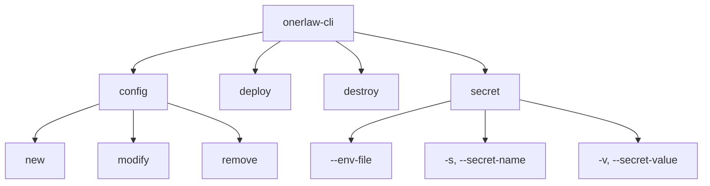
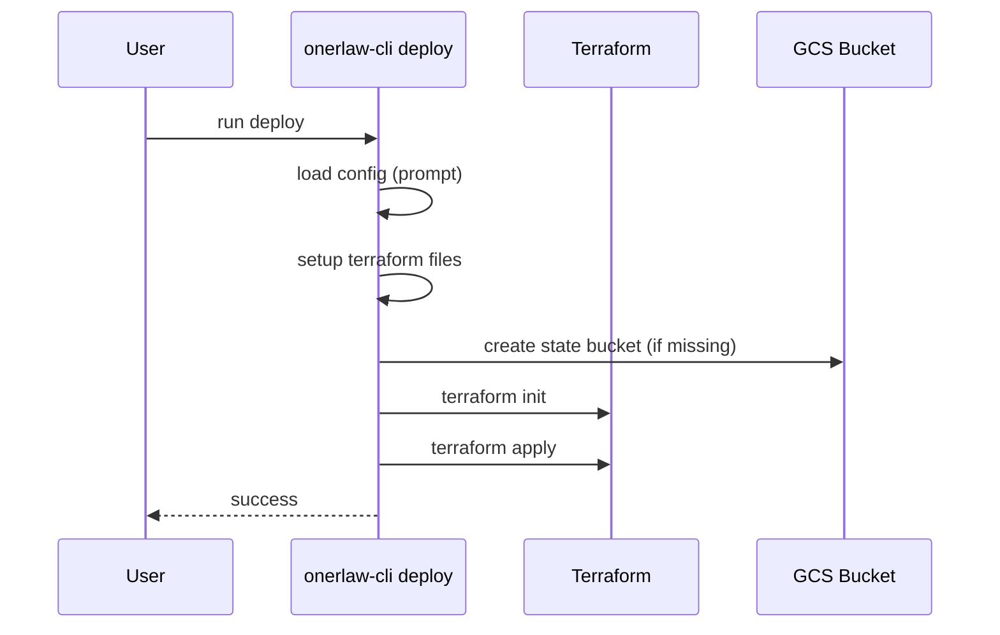
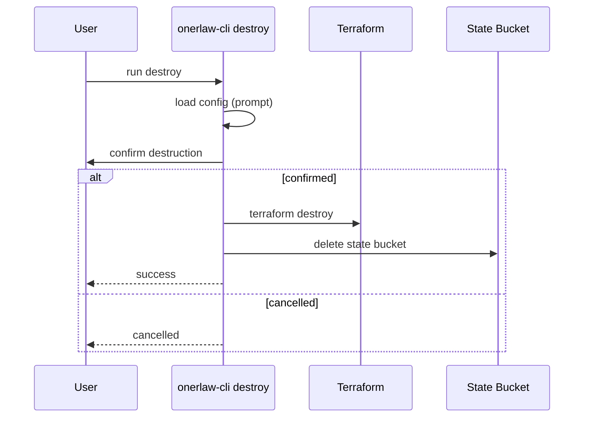
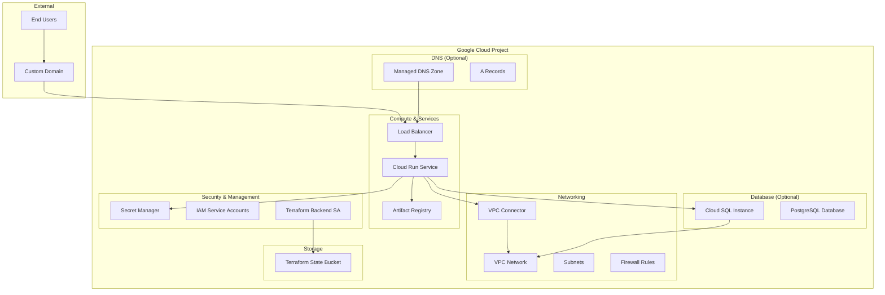
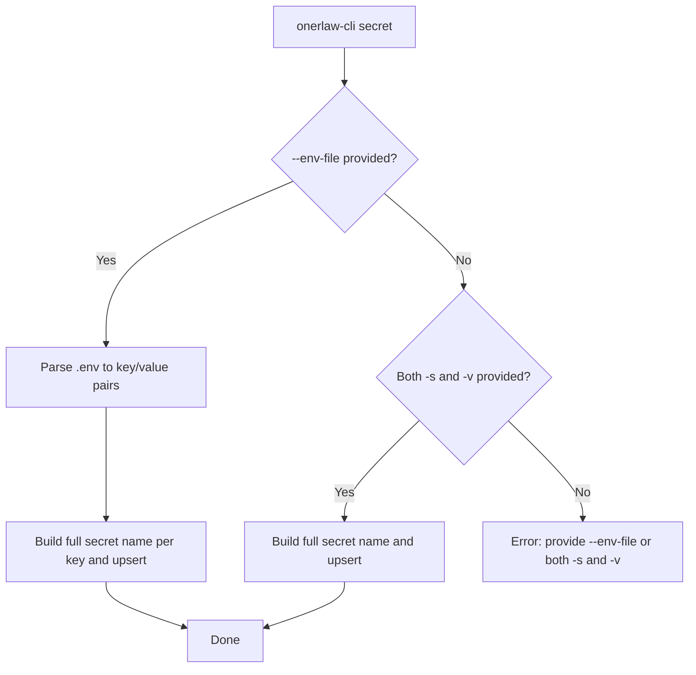

# Onerlaw CLI

A powerful command-line interface for deploying and managing Google Cloud infrastructure using Terraform. The Onerlaw CLI simplifies the process of setting up, configuring, and managing cloud infrastructure with an intuitive command structure.

## Features

- 🚀 **Infrastructure as Code**: Deploy complete Google Cloud infrastructure using Terraform
- 🔧 **Configuration Management**: Easy configuration creation, modification, and removal
- 🔐 **Secret Management**: Secure handling of sensitive information via Google Secret Manager
- 🗑️ **Clean Destruction**: Safely destroy infrastructure when no longer needed
- 🌐 **Multi-Environment Support**: Support for dev, staging, and production environments
- 📦 **Modular Architecture**: Well-organized Terraform modules for maintainable infrastructure

## Installation

```bash
npm install -g @onerlaw/cli
```

## Commands Overview

### Command Tree



### Configuration Management

#### `config new`
Creates a new configuration for your infrastructure deployment.

```bash
onerlaw-cli config new
```

This command will prompt you for:
- Google Cloud Project ID
- Environment type (dev, staging, prod)
- Environment name
- Database configuration (optional)
- DNS configuration (optional)

#### `config modify`
Modifies existing configurations.

```bash
onerlaw-cli config modify
```

Allows you to update:
- Project settings
- Environment configurations
- Database parameters
- DNS settings

#### `config remove`
Removes existing configurations.

```bash
onerlaw-cli config remove
```

Safely removes configuration files and associated resources.

### Infrastructure Deployment

#### `deploy`
Deploys the complete infrastructure using Terraform.

```bash
onerlaw-cli deploy
```

This command:
1. Loads your configuration
2. Sets up Terraform configuration files
3. Creates necessary Google Cloud Storage buckets
4. Initializes Terraform
5. Applies the infrastructure configuration



### Infrastructure Destruction

#### `destroy`
Safely destroys all deployed infrastructure.

```bash
onerlaw-cli destroy
```

⚠️ **Warning**: This will permanently delete all resources. Use with caution.



### Secret Management

#### `secret`
Creates or updates Google Cloud secrets. Project and environment are loaded from your saved configuration via an interactive prompt.

Two usage modes:

- Single secret:
  ```bash
  onerlaw-cli secret \
    -s <secret-name> \
    -v <secret-value>
  ```

- From .env file (bulk upsert of KEY=VALUE pairs):
  ```bash
  onerlaw-cli secret --env-file ./path/to/.env
  ```

**Options:**
- `-s, --secret-name <secret-name>`: Name of the secret (without environment prefix)
- `-v, --secret-value <secret-value>`: Value of the secret
- `--env-file <path>`: Path to a .env file; when provided, `-s`/`-v` are not required

## Apps Configuration Feature

The CLI now supports configuring multiple applications per environment, each with its own container image and optional port specification. This enables deploying microservices architectures where each service runs independently on Cloud Run.

### Schema

Each app in the `apps` array contains:

```typescript
{
  name: string              // Required: App name (1-63 characters)
  port?: number            // Optional: Port number (1-65535)
}
```

### Usage

When creating or modifying configurations, the CLI will prompt for:

1. **App name**: A unique identifier for the application
2. **Port specification**: Optional custom port (defaults to 3000 if not specified)

**Note**: Container images are automatically derived based on the app name, project ID, environment, and environment name using the pattern: `us-central1-docker.pkg.dev/{project_id}/{environment}-{environment_name}/{app_name}:latest`

### Terraform Integration

The infrastructure automatically creates:

- **Multiple Cloud Run services**: One service per app with individual configurations
- **Load balancer routing**: Traffic distribution across all configured services
- **Service accounts**: Individual service accounts for each app with proper IAM permissions
- **Pub/Sub integration**: Each service gets appropriate publisher/subscriber permissions

### Example Configuration

```json
{
  "apps": [
    {
      "name": "api-server",
      "port": 8080
    },
    {
      "name": "worker",
      "port": 9090
    },
    {
      "name": "monitoring"
    }
  ]
}
```

### Example Generated Container Images

For a project with ID `my-project`, environment `dev`, and environment name `my-app`:

- **api-server**: `us-central1-docker.pkg.dev/my-project/dev-my-app/api-server:latest`
- **worker**: `us-central1-docker.pkg.dev/my-project/dev-my-app/worker:latest`
- **monitoring**: `us-central1-docker.pkg.dev/my-project/dev-my-app/monitoring:latest`

### Benefits

- **Microservices architecture**: Deploy multiple independent services
- **Individual scaling**: Each service can scale independently based on demand
- **Separate configurations**: Different ports, resources, and environment variables per service
- **Load balancing**: Automatic traffic distribution across services
- **Isolated permissions**: Each service has its own service account and IAM roles

## Architecture Overview

The Onerlaw CLI creates a comprehensive Google Cloud infrastructure with the following components:



## Secret Workflow



### Infrastructure Components

#### **Networking Module**
- VPC network with private subnets
- Firewall rules for secure communication
- VPC connector for Cloud Run to access private resources

#### **Cloud Run Module**
- Serverless container deployment
- Auto-scaling based on demand
- Integration with VPC and Secret Manager
- Customizable CPU and memory allocation

#### **Cloud SQL Module (Optional)**
- PostgreSQL database instance
- Private networking for security
- Automated password management via Secret Manager
- Configurable instance tiers

#### **Artifact Registry Module**
- Container image storage
- Integration with Cloud Run deployments
- Regional deployment for performance

#### **Load Balancer Module (Optional)**
- Global HTTPS load balancer
- SSL certificate management
- Domain-based routing to Cloud Run

#### **DNS Module (Optional)**
- Managed DNS zones
- Automatic A record creation
- Support for primary domain and www subdomain

#### **Security Features**
- Service accounts with minimal permissions
- Secret Manager integration
- Private networking for sensitive resources
- IAM role-based access control

## Configuration

The CLI uses a configuration system that stores your infrastructure preferences. Configuration files are created in your project directory and include:

- Project settings
- Environment configurations
- Database parameters
- DNS settings
- Resource specifications

## Environment Support

The CLI supports three environment types:

- **dev**: Development environment with minimal resources
- **staging**: Staging environment for testing
- **prod**: Production environment with full resources

Each environment can have a unique name (e.g., "my-app-dev", "my-app-staging", "my-app-prod").

## Prerequisites

Before using the Onerlaw CLI, ensure you have:

1. **Google Cloud SDK** installed and configured
2. **Terraform** installed (version 1.0 or higher)
3. **Node.js** (version 18 or higher)
4. **Google Cloud Project** with billing enabled
5. **Required APIs** enabled in your project

## Getting Started

1. **Install the CLI**:
   ```bash
   npm install -g @onerlaw/cli
   ```

2. **Create a new configuration**:
   ```bash
   onerlaw-cli config new
   ```

3. **Deploy your infrastructure**:
   ```bash
   onerlaw-cli deploy
   ```

4. **Manage secrets** (if needed):
   ```bash
   # single secret
   onerlaw-cli secret -s db-password -v mypassword

   # or bulk from .env file
   onerlaw-cli secret --env-file ./path/to/.env
   ```

5. **Clean up** (when done):
   ```bash
   onerlaw-cli destroy
   ```

## Development

### Building from Source

```bash
git clone <repository-url>
cd onerlaw-cli
npm install
npm run build
```

### Available Scripts

- `npm run build`: Build the TypeScript code
- `npm run dev`: Run in development mode
- `npm run validate`: Build, lint, and format code
- `npm run test`: Run tests
- `npm run format`: Format code with Prettier

### Code Style

The project follows strict coding standards:
- TypeScript with strict mode
- ESLint for code quality
- Prettier for code formatting
- Single responsibility principle for functions
- Comprehensive error handling

## Contributing

1. Fork the repository
2. Create a feature branch
3. Make your changes
4. Run `npm run validate` to ensure code quality
5. Submit a pull request

## License

ISC License

## Support

For issues and questions, please check the repository issues or contact the development team.
