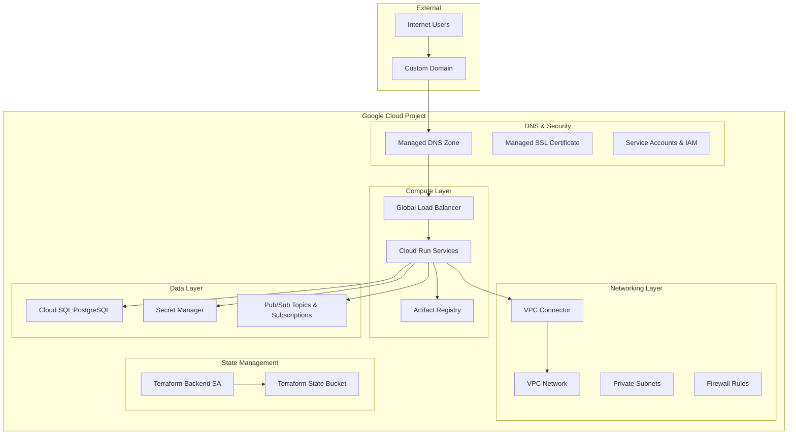

# Terraform Infrastructure Architecture

This document describes the complete infrastructure architecture created by the Onerlaw CLI using Terraform.

## Overview

The Onerlaw CLI deploys a comprehensive, production-ready Google Cloud infrastructure that supports modern web applications with features like:

- **Serverless compute** with Cloud Run
- **Managed databases** with Cloud SQL (PostgreSQL)
- **Container registry** with Artifact Registry
- **Global load balancing** with automatic SSL certificates
- **DNS management** with Cloud DNS
- **Message queuing** with Pub/Sub
- **Secrets management** with Secret Manager
- **Private networking** with VPC and connectors

## Infrastructure Components

### Core Architecture



## Module Breakdown

### 1. Networking Module (`modules/networking`)

**Purpose**: Establishes the foundation network infrastructure for all resources.

**Components Created**:
- **VPC Network**: Private network with custom subnets
- **Private Subnet**: Regional subnet with private Google access enabled
- **Firewall Rules**: Security rules allowing necessary traffic
- **VPC Connector**: Serverless VPC Access connector for Cloud Run

**Key Features**:
- Private networking for enhanced security
- Serverless VPC Access for Cloud Run integration
- Regional deployment for performance
- Configurable IP ranges

**Naming Convention**: `{environment}-{environment_name}-vpc`

### 2. Cloud Run Module (`modules/cloud-run`)

**Purpose**: Deploys containerized applications as serverless services.

**Components Created**:
- **Cloud Run Service**: Serverless container deployment
- **Service Account**: Dedicated IAM identity per service
- **IAM Bindings**: Permissions for database, secrets, and Pub/Sub access

**Key Features**:
- Auto-scaling (0 to configurable max instances)
- VPC connectivity for database access
- Secret Manager integration
- Custom environment variables
- Configurable CPU/memory allocation
- Support for custom ports

**Service Naming**: `{environment}-{environment_name}-{app_name}`

### 3. Cloud SQL Module (`modules/cloud-sql`)

**Purpose**: Provides managed PostgreSQL database instances.

**Components Created**:
- **Cloud SQL Instance**: PostgreSQL database server
- **Database**: Application-specific database
- **Database User**: Application user with appropriate permissions
- **Private Service Connection**: VPC peering for private access
- **Secret Manager Secrets**: Database credentials and connection strings

**Key Features**:
- Private networking (no public IP)
- Automated backups and maintenance
- High availability configuration
- Automatic password generation and storage
- Connection string generation

**Security**:
- Passwords stored in Secret Manager
- Private IP only access
- VPC-native networking

### 4. Artifact Registry Module (`modules/artifact-registry`)

**Purpose**: Stores and manages container images.

**Components Created**:
- **Docker Repository**: Container image storage
- **IAM Bindings**: Access permissions for Cloud Run services

**Key Features**:
- Regional deployment for performance
- Integration with Cloud Run
- Automatic image scanning
- Vulnerability analysis

**Repository Format**: `{environment}-{environment_name}`

### 5. Load Balancer Module (`modules/load-balancer`)

**Purpose**: Provides global load balancing with SSL termination.

**Components Created**:
- **Global HTTP(S) Load Balancer**: Traffic distribution
- **Backend Services**: Route traffic to Cloud Run services
- **URL Map**: Path-based routing configuration
- **Network Endpoint Groups (NEGs)**: Serverless NEGs for Cloud Run
- **Managed SSL Certificate**: Automatic SSL certificate provisioning
- **Global IP Address**: Static external IP

**Key Features**:
- Automatic SSL certificate management
- Global anycast IP for performance
- Health checking for backend services
- Support for multiple Cloud Run services

**DNS Integration**: Automatic certificate validation via DNS

### 6. DNS Module (`modules/dns`)

**Purpose**: Manages DNS records and zones.

**Components Created**:
- **Managed DNS Zone**: Cloud DNS zone for domain management
- **A Records**: Primary domain and subdomain records
- **DNSSEC**: Enhanced security for DNS responses
- **Cloud Logging**: DNS query monitoring

**Key Features**:
- Automatic DNS record creation
- DNSSEC support for security
- Subdomain management
- Integration with load balancer IP

**Record Types**:
- Primary domain → Load balancer IP
- Subdomains → Load balancer IP
- Optional www subdomain

### 7. Pub/Sub Module (`modules/pubsub`)

**Purpose**: Provides asynchronous messaging capabilities.

**Components Created**:
- **Pub/Sub Topic**: Message publishing endpoint
- **Subscription**: Message consumption endpoint
- **Dead Letter Topic**: Failed message handling (optional)
- **IAM Bindings**: Publisher and subscriber permissions

**Key Features**:
- Guaranteed message delivery
- Configurable retry policies
- Dead letter queue support
- Integration with Cloud Run services

**IAM Integration**: Cloud Run services get appropriate publisher/subscriber roles

## Conditional Resource Creation

The infrastructure uses intelligent conditional logic to only create resources when needed:

### Database Resources
```hcl
locals {
  cloud_sql_enabled = var.database_name != null && var.database_user != null
}
```
- Cloud SQL instance only created when database configuration is provided
- Database secrets only created when database is enabled
- VPC peering only established when database is present

### Load Balancer Resources
```hcl
locals {
  load_balancer_enabled = length(var.apps) > 0 && anytrue([for app in var.apps : app.dns != null])
}
```
- Load balancer only created when apps have DNS configuration
- SSL certificates only provisioned when domains are specified
- DNS records only created when load balancer is enabled

### Pub/Sub Resources
```hcl
locals {
  pubsub_enabled = var.pubsub_topic_name != null
}
```
- Pub/Sub resources only created when topic name is provided
- Subscriptions and IAM bindings conditional on Pub/Sub enablement

## Security Architecture

### Identity and Access Management

1. **Service Accounts**:
   - Dedicated service account per Cloud Run service
   - Terraform backend service account for state management
   - Principle of least privilege

2. **IAM Roles**:
   - Cloud SQL Client (for database access)
   - Secret Manager Secret Accessor (for secrets)
   - Pub/Sub Publisher/Subscriber (for messaging)
   - Artifact Registry Reader (for image pulls)

3. **Network Security**:
   - Private subnets with no external IPs
   - VPC-native networking
   - Firewall rules restricting traffic
   - Private Google access for API calls

### Secrets Management

1. **Database Credentials**:
   - Passwords auto-generated and stored in Secret Manager
   - Connection strings constructed and stored securely
   - No hardcoded credentials in configuration

2. **Application Secrets**:
   - Support for custom application secrets
   - Environment-specific secret naming
   - Automatic injection into Cloud Run services

## Monitoring and Observability

### Logging
- **Cloud Run Logs**: Application and system logs
- **Load Balancer Logs**: Traffic and performance metrics
- **DNS Query Logs**: DNS resolution monitoring

### Monitoring
- **Cloud Run Metrics**: Request latency, error rates, resource usage
- **Load Balancer Metrics**: Global traffic patterns
- **Database Metrics**: Connection counts, query performance

## Environment Isolation

The infrastructure supports multiple environments through:

1. **Resource Naming**: All resources prefixed with `{environment}-{environment_name}`
2. **State Isolation**: Separate Terraform state files per environment
3. **Network Isolation**: Separate VPCs per environment
4. **IAM Isolation**: Environment-specific service accounts

## Disaster Recovery

### State Management
- **Terraform State**: Stored in Google Cloud Storage with versioning
- **State Locking**: Prevents concurrent modifications
- **Backend Service Account**: Dedicated credentials for state access

### Backup and Recovery
- **Database Backups**: Automatic daily backups with point-in-time recovery
- **Configuration Backup**: Infrastructure as Code enables full reconstruction
- **Container Images**: Immutable images stored in Artifact Registry

## Cost Optimization

### Serverless Architecture
- **Cloud Run**: Pay-per-request pricing with automatic scaling to zero
- **Load Balancer**: Global anycast reduces latency and costs
- **Database**: Configurable instance sizes for cost control

### Resource Efficiency
- **Shared Resources**: Single VPC and load balancer across apps
- **Conditional Creation**: Only deploy resources when needed
- **Auto-scaling**: Resources scale based on demand

## Best Practices Implemented

1. **Security First**: Private networking, IAM, secrets management
2. **Scalability**: Auto-scaling compute and global load balancing
3. **Reliability**: Managed services with built-in redundancy
4. **Maintainability**: Infrastructure as Code with clear module structure
5. **Cost-Effectiveness**: Serverless and pay-per-use services
6. **Observability**: Comprehensive logging and monitoring
